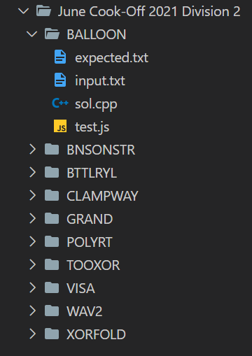

<div align="center">

<h1>CodeChef Bot</h1>

<p>
  <strong>A bot to fetch questions and test cases from CodeChef.</strong>
</p>


<p>
  <sub>Made with ❤︎ by
    <a href="https://github.com/wandering-sage">Shivam Kumar</a>
  </sub>
</p>
</div>

## Description
- This is a command line program that will create files for the corresponding questions of the given contest.
- Just provide contest code and the directory where you want to save the files, this bot will fetch questions and test cases and make 4 files, i.e. sol.cpp, input.txt, expected.txt and test.js for each question.
- sol.cpp is just the copy of template.cpp of this repo feel free to change it to your preference.
- This bot is created to help you save time and to keep your codes organised.

## Results


## Getting Started
- Clone this repo and unzip the folder on desktop or wherever you want.
- Launch your **Terminal** or **Command prompt**
- Change directory to where you unzipped this folder.
```bash
cd Desktop
cd codechef-bot
```
- Type npm install to install all dependencies.
```bash
npm install
```
- To start the bot type node index.js
```bash
node index.js
```
- Provide the Contest code in config.js or provide it while running the file.
```bash
node index.js COOK130B
```
- You can also porvide, the directory where you want to create these files, either set it in config.js or pass it as second argument.
```bash
node index.js COOK130B "D:\Vs C++"
```

## Features


